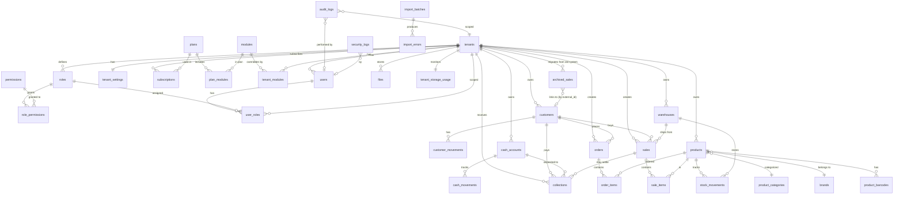
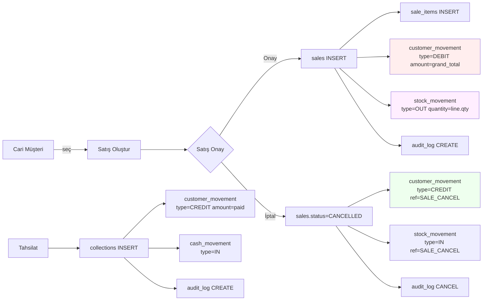
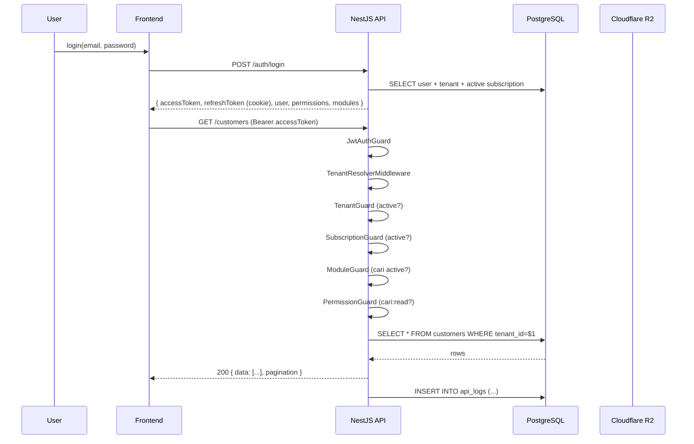

# VERİTABANI ER DİYAGRAM (Mermaid)

Aşağıdaki diyagram `mermaid` blokları içerir. GitHub/GitLab/Notion'da otomatik render edilir; VS Code'da "Markdown Preview Mermaid Support" eklentisi ile görüntülenir.

---

## 1. ÜST DÜZEY ER

---

## 2. CARI AKIŞ DETAYI (SATIŞ + TAHSİLAT)

---

## 3. AUTH + TENANT PIPELINE

